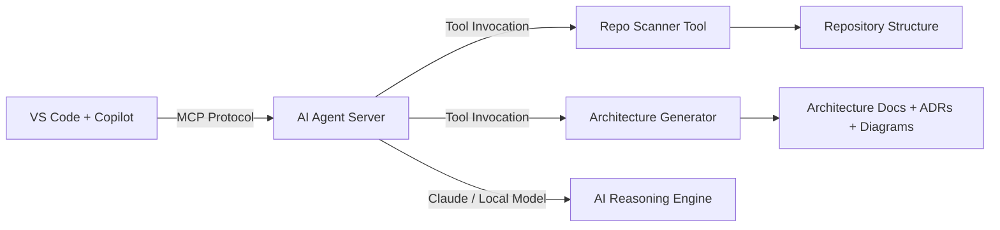

# AI Agent Architect

A fully extensible **AI Architecture Agent** built using the **Model Context Protocol (MCP)**, designed to analyze repositories, generate architecture documentation, produce ADRs, create diagrams, and assist developers with engineering decisions.  
This project demonstrates modern AI-agent engineering using Claude, local MCP servers, custom tools, and repo-as-agent patterns.

---

## 📌 Overview

This project implements a **Claude-powered AI agent** capable of:

- Scanning repository structures
- Generating architecture documentation
- Producing ADRs (Architectural Decision Records)
- Creating sequence diagrams (Mermaid)
- Suggesting microservice decomposition
- Analyzing code quality and patterns
- Acting as a local MCP server inside VS Code
- Running fully free using local models (Ollama) or Claude free tier

The agent is designed to be **developer-friendly**, **extensible**, and **cloud-agnostic**, making it ideal for showcasing AI engineering expertise.

---

## 🎯 Goals of This Project

This demo highlights your ability to design and implement:

- AI agent workflows
- MCP server architecture
- Custom tool integration
- Repository analysis automation
- Architecture generation using AI
- Developer-centric agent design
- Local + cloud AI hybrid patterns
- GitHub-ready agent packaging

---

## 🧠 What This Agent Can Do

### 1. Repository Analysis
- Reads folder structures
- Identifies modules, services, boundaries
- Suggests microservice decomposition

### 2. Architecture Documentation
- Generates Markdown architecture docs
- Creates Mermaid diagrams
- Produces ADRs with rationale

### 3. Developer Assistance
- Summaries of code
- API documentation generation
- Design pattern recommendations

### 4. AI Agent Behaviors
- Multi-step reasoning
- Tool invocation
- Context-aware responses

---

## 🏗️ Architecture

### System Overview



---

## 🧰 Prerequisites

Before running the project locally, make sure you have:

- Python 3.11 or newer
- Git
- VS Code
- Optional: access to Claude or a local model runtime such as Ollama

---

## 📦 Dependencies

This project is intentionally lightweight. The core runtime is Python standard library only, and dependencies can be extended as the agent grows.

Install the project dependencies:

```bash
python -m venv .venv

# Windows PowerShell
.\.venv\Scripts\Activate.ps1

# macOS / Linux
source .venv/bin/activate

python -m pip install --upgrade pip
pip install -r requirements.txt
```

For optional testing utilities:

```bash
pip install pytest
```

---

## 🔨 Build Instructions

This project does not require a traditional build pipeline, but you should validate the Python files before running the server:

```bash
python -m compileall server.py tools
```

This compiles the server and helper modules to catch syntax errors early.

---

## ✅ Test Instructions

A simple smoke test can verify that the repository scanning and document generation logic works:

```bash
python -c "from tools.doc_generator import generate_architecture_doc, generate_adr; print(generate_architecture_doc('Smoke Test', '.')['status']); print(generate_adr('Local Deployment', 'Accepted', '.')['status'])"
```

If you later add automated tests, run:

```bash
python -m pytest -q
```

---

## 🚀 Local Deployment

### Option 1: Run the local MCP server directly

From the project root:

```bash
python server.py
```

The server listens for JSON commands and supports actions such as:

```json
{"action":"analyze_repository","payload":{"path":"."}}
{"action":"generate_architecture","payload":{"path":".","project_name":"AI Agent Architect"}}
{"action":"create_adr","payload":{"path":".","title":"Adopt MCP-first architecture","status":"Accepted"}}
```

### Option 2: Run through VS Code MCP integration

The workspace already includes a VS Code MCP config at `.vscode/mcp.json`.

```json
{
  "servers": {
    "ai-agent-architect": {
      "command": "python",
      "args": ["${workspaceFolder}/server.py"],
      "cwd": "${workspaceFolder}",
      "env": {
        "PYTHONPATH": "${workspaceFolder}"
      }
    }
  }
}
```

Once configured, VS Code can start the MCP server from the project root and use it as a local AI tool provider.

---

## 🧭 Typical Workflow

1. Clone the repository
2. Create and activate a Python virtual environment
3. Install dependencies
4. Run the local server
5. Use repo analysis tools to inspect a target project
6. Generate architecture docs and ADRs
7. Review generated Markdown outputs in `workflows/` and `examples/`

---

## 📁 Project Structure

```text
ai-agent-architect/
  README.md
  server.py
  requirements.txt
  tools/
    __init__.py
    git_tools.py
    doc_generator.py
  workflows/
    architecture/
    adr/
  skills/
    repo-analysis/
    architecture-generation/
  examples/
    prompts/
    outputs/
  .vscode/
    mcp.json
```

---

## 💡 Notes

- The project is intentionally modular so new tools, workflows, or AI providers can be added without redesigning the entire system.
- The current implementation is a clean starting point for a local architecture-agent demo and can be extended with real LLM integrations, Git APIs, or repository-aware analysis services.
