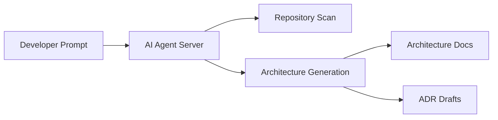

# Demo Architecture Overview

Date: 2026-09-25

## Purpose
This document captures the system architecture for the AI Agent Architect project and highlights the repository structure, workflow boundaries, and extensibility points.

## High-Level Components
- VS Code / Copilot client
- Local MCP server
- Repository analysis tools
- Architecture generation workflows
- ADR generation support

## Workflow

## Repository Layout
- `server.py` hosts the MCP server entry point.
- `tools/` contains repository and documentation utilities.
- `workflows/` contains architecture and ADR outputs.
- `skills/` stores reusable reasoning or task-specific guidance.
- `examples/` captures prompts and generated outputs.
